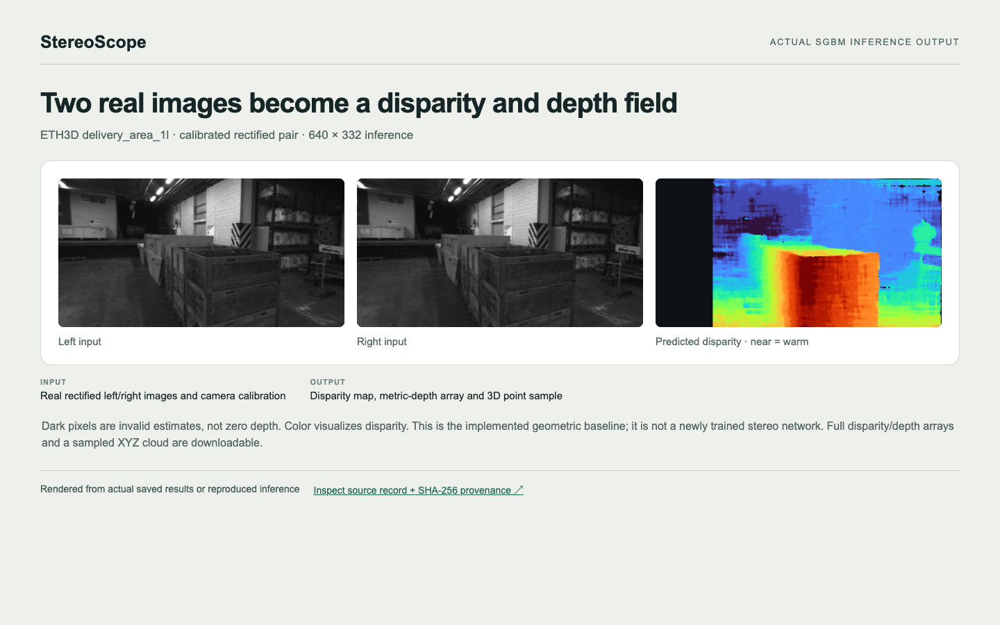
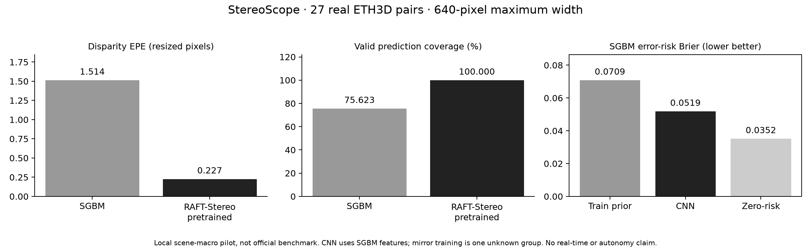
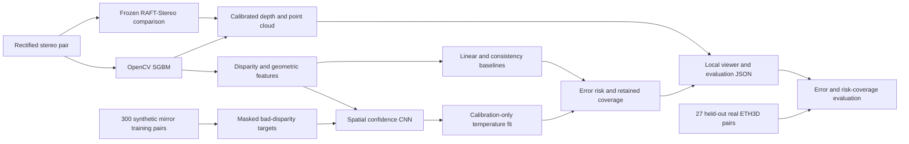

# StereoScope — Confidence-Aware Stereo Perception

## Actual output example



**Input:** Real rectified left/right images and camera calibration. **Output:** Disparity map, metric-depth array and 3D point sample.

Dark pixels are invalid estimates, not zero depth. Color visualizes disparity. This is the implemented geometric baseline; it is not a newly trained stereo network. Full disparity/depth arrays and a sampled XYZ cloud are downloadable.

[Inspect the full output record and source hashes](docs/output-example.json) · [Open the standalone review page](docs/output-showcase.html) · [Original dataset](https://www.eth3d.net/datasets)

- [Predicted disparity/depth arrays](docs/disparity-depth-output.npz)
- [Sampled 3D XYZ points](docs/point-cloud-sample.csv)

### Reproduce this example

Follow the project setup/data steps below first. `--source` points to a reproduced project directory with its local data, saved predictions or checkpoints; use `.` when running in that directory. The exporter never silently invents missing inputs.

```bash
python docs/extract_showcase.py --source /path/to/reproduced/project
python docs/render_showcase.py
# Open docs/output-showcase.html directly, or capture the image with Chrome:
npm install --no-save playwright
node docs/capture_showcase.mjs
```

The JSON records the exact source-relative filenames, SHA-256 hashes and code revision. Rendering uses saved values; displayed decimals are rounded only for readability. Raw datasets and model checkpoints remain outside this documentation bundle.


StereoScope asks a practical perception question: when two cameras estimate depth, can a learned confidence model identify the estimates a downstream system should not trust?

The implementation contains calibrated stereo geometry, OpenCV and pretrained RAFT-Stereo comparators, a trained spatial confidence CNN, a linear comparator, calibration/evaluation separation and a local workbench. **It does not control a robot, establish collision avoidance or claim the completed multi-scene training benchmark.** Current evidence is a real 27-pair depth comparison and a 300-frame, one-unknown-group confidence-transfer pilot.



## Dataset at a glance

One stereo example consists of a **left image, right image and reference disparity** (horizontal pixel displacement used with calibration to recover depth). The confidence-model pilot trains on **300 synthetic stereo pairs from a third-party SceneFlow mirror**, calibrates on **three official FlyingThings3D sampler frames**, and evaluates on **27 real labelled ETH3D stereo pairs**. ETH3D is excluded from fitting and calibration.

Because the mirror lacks original scene IDs, all 300 training pairs are treated as **one unknown scene group**, not 300 independent scenes. Its origin is not independently authenticated, and train/calibration scene independence is not proven. These are a bounded training pilot and an external test set—not a full SceneFlow benchmark. See the provenance and limitations below and [`outputs/mirror-pilot-provenance.json`](outputs/mirror-pilot-provenance.json).

## Technical snapshot

| Question | Implementation |
|---|---|
| What predicts depth? | OpenCV StereoSGBM or frozen SceneFlow-pretrained RAFT-Stereo + calibrated geometry |
| What is actually trained here? | A 6-input-channel spatial CNN predicting disparity-error probability; a 1x1 logistic comparator |
| What enters the confidence model? | Left luminance, disparity, photometric residual, left/right consistency, texture and disparity gradient |
| Does ground truth leak into prediction? | No; ground truth is used only for training targets and evaluation |
| How are scenes separated? | Stable scene-group manifests; train/calibration/test separation and checkpoint overlap guards |
| What data is currently evaluated? | 27 real ETH3D labelled stereo pairs, kept outside fitting and calibration; CNN training uses 300 mirrored synthetic pairs as ONE unknown group |
| Is this production-ready? | No; research prototype, not navigation, safety certification or proven real-time perception |

## System flow

```text
rectified stereo pair + calibration
    → SGBM left/right disparity
    → consistency / photometric / local-texture features
    → learned error-risk or geometric heuristic
    → calibrated depth + optional risk mask
    → point cloud / inspection UI / held-out error report
```

## Architecture



### Pre-processing

Inputs must already be rectified stereo images. The ETH3D adapter reads camera intrinsics, principal-point offset and baseline, converts baseline millimetres to metres, and preserves depth when resizing camera parameters and disparity. Invalid and non-positive disparities remain invalid, never fabricated as near objects. SceneFlow adapters support official full cleanpass, WebP and sample layouts. SceneFlow depth is in Blender units, not automatically metres.

### Depth and confidence models

StereoSGBM returns left disparity and flipped-right disparity for consistency checking. RAFT-Stereo uses the original SceneFlow-only checkpoint, an explicit pure-PyTorch correlation path, correct negative-flow-to-positive-disparity conversion and Apple MPS. The CNN has 4,369 parameters, three 3x3 convolution layers (16→16→8 channels), a one-channel logit head and a 7x7 receptive field. **This CNN is trained on SGBM features, not RAFT features**, and predicts error risk without changing disparity. The evaluator rejects mismatched backends. Temperature scaling uses calibration scenes only. Constant training-prior and zero-risk baselines expose misleading confidence claims under class imbalance.

### Post-processing and evaluation

Depth is `fx * baseline / (disparity + doffs)`. Unreliable estimates can be hidden in the point-cloud viewer, but evaluation always retains unfiltered prediction coverage and counts invalid estimates as failures in the all-labelled custom D1 statistic. Risk curves also report retained coverage against all labelled pixels.

Custom D1 means error >3 pixels **and** >5% at the evaluation resolution. ETH3D-style bad1/bad2/bad4 are also reported on valid predictions. These local resized scores are **not official ETH3D hidden-test leaderboard results**. Confidence filtering is not an accuracy improvement claim unless coverage is shown alongside it.

## What works today

- genuine ETH3D data loading, calibrated geometry, SGBM and complete 27-pair baseline evaluation
- learned CNN and linear training, explicit scene separation, temperature calibration, saved checkpoints
- external real-data confidence evaluation and risk–coverage JSON
- point-cloud and error inspection through Streamlit
- geometry, file-format, split-leakage, known-shift and model-gradient tests

## Measured result, with context

At maximum width 640, both methods were evaluated on the same 27 ETH3D pairs. Values are image/scene-macro means in resized image space; valid-prediction errors have different coverage, so no simple relative accuracy gain is claimed.

| Depth method | EPE valid (px) | Custom D1 valid | Labelled coverage | All-labelled custom D1 |
|---|---:|---:|---:|---:|
| SGBM | 1.514 | 3.52% | 75.62% | 26.69% |
| Pretrained RAFT-Stereo | 0.227 | 0.83% | 100.00% | 0.83% |

The own confidence CNN and linear model were each trained for 10 epochs on **300 synthetic mirrored pairs**; all frames are conservatively assigned to **ONE unknown group**, since original scene names are missing. Three official FlyingThings3D sampler frames provide calibration. ETH3D is never used for fitting or calibration. The mirror's claimed origin is not independently authenticated, and absence of byte-hash overlap does not prove scene independence from the calibration sampler.

| SGBM error-risk method | External ETH3D Brier (lower better) |
|---|---:|
| Constant training error prior | 0.07087 |
| Spatial CNN | 0.05186 |
| Linear comparator | 0.03828 |
| Always zero error-risk | 0.03518 |

**Negative result:** the CNN is worse calibrated than the linear and trivial zero-risk baselines after transfer. It therefore does not establish reliable probability estimates. Its ranking is useful in this pilot: at 70% retained *valid* predictions, custom D1 is 1.51% versus 1.81% for geometric consistency. That retention is only about 53% of all labelled pixels, and must not be presented as improved dense accuracy. Risk ties use expected random tie-breaking rather than image order.

Earlier 9-frame official sampler runs are retained as smoke tests only. Full verified multi-scene SceneFlow training, corruption ablations and broader calibration remain incomplete. The frozen stereo comparison is implemented and measured; it is not presented as a newly trained stereo network.

See `outputs/eth3d_sgbm.json`, `outputs/eth3d_raft.json`, `outputs/eth3d_mirror_cnn.json`, `outputs/eth3d_mirror_linear.json` and [MODEL_CARD.md](MODEL_CARD.md). Checkpoint metadata records training IDs, groups, manifest hash, seed, epochs, temperature and device. Raw data, upstream weights and training checkpoints are excluded from publishing; the mirror's redistribution terms are not established.

## Requirements

- Python 3.11–3.13 recommended; tested with Python 3.12 and Apple MPS
- CPU for SGBM; Apple MPS/CUDA/CPU selectable for the small confidence model
- About 130 MB official pilot assets, plus environment/caches; larger SceneFlow archives require considerably more storage and download time
- No API key and no external inference service

## Run on macOS or Linux

```bash
python3 -m venv .venv
source .venv/bin/activate
python -m pip install -e '.[test]'
python scripts/fetch_pilot_data.py
stereoscope prepare --dataset eth3d --root data/eth3d --output data/eth3d-manifest.json
stereoscope evaluate --manifest data/eth3d-manifest.json --output outputs/eth3d_sgbm.json
stereoscope prepare --dataset sceneflow --root data/sceneflow/Sampler --output data/sampler-manifest.json
stereoscope train --manifest data/sampler-manifest.json --output checkpoints/sampler-cnn.pt --epochs 60
stereoscope evaluate --manifest data/eth3d-manifest.json --checkpoint checkpoints/sampler-cnn.pt --output outputs/eth3d_sampler_cnn.json
streamlit run app.py
```

For the linear comparator, add `--architecture linear` to training and use a separate checkpoint filename. To prepare the full acquired SceneFlow directory, pass that directory instead of the sampler. The manifest determines the actual dataset scale; no command claims assets have been downloaded when they have not.

### Reproduce the 300-frame pilot and RAFT comparison

```bash
python -m pip install -e '.[test,raft]'
git clone https://github.com/princeton-vl/RAFT-Stereo.git data/vendor/RAFT-Stereo
git -C data/vendor/RAFT-Stereo checkout 6e93ed2169bd858dbb43033988563f3b0bb49506
python scripts/fetch_raft.py
stereoscope evaluate --manifest data/eth3d-manifest.json --backend raft --output outputs/eth3d_raft.json
python scripts/fetch_mirror_pilot.py --pairs 300
python scripts/prepare_mirror_pilot.py --pairs 300
stereoscope train --manifest data/mirror-pilot-manifest.json --output checkpoints/mirror-cnn.pt --epochs 10
stereoscope evaluate --manifest data/eth3d-manifest.json --checkpoint checkpoints/mirror-cnn.pt --output outputs/eth3d_mirror_cnn.json
stereoscope train --manifest data/mirror-pilot-manifest.json --output checkpoints/mirror-linear.pt --architecture linear --epochs 10
stereoscope evaluate --manifest data/eth3d-manifest.json --checkpoint checkpoints/mirror-linear.pt --output outputs/eth3d_mirror_linear.json
python scripts/portfolio_plot.py
```

The mirror is optional and explicitly unverified; review its provenance caveat before downloading. This workflow does not relabel it as an official host or a complete scene-aware benchmark.

## Run on Windows PowerShell

```powershell
py -3.12 -m venv .venv
.\.venv\Scripts\Activate.ps1
python -m pip install -e ".[test]"
python scripts/fetch_pilot_data.py
stereoscope prepare --dataset eth3d --root data/eth3d --output data/eth3d-manifest.json
streamlit run app.py
```

## Tests

```bash
pytest -q
```

Known-shift tests use artificial images for software verification only, not as benchmark evidence. Real evaluation uses downloaded image/ground-truth pairs.

## Data and limitations

- [ETH3D datasets](https://www.eth3d.net/datasets): 27 labelled pairs, [official benchmark overview](https://www.eth3d.net/overview). Preserve original terms/attribution; do not commit raw assets.
- [SceneFlow original source and research-only terms](https://lmb.informatik.uni-freiburg.de/resources/datasets/SceneFlowDatasets.en.html): commercial use prohibited. The sample pack is not a substitute for the full dataset.
- [RAFT-Stereo upstream](https://github.com/princeton-vl/RAFT-Stereo): implemented comparison using the SceneFlow-only checkpoint. A checkpoint trained on ETH3D must not be used to claim unseen ETH3D generalisation.
- [Mirror used for the 300-frame pilot](https://huggingface.co/datasets/olivermao/sceneflow): lacks original scene metadata, dataset card and declared license. Source attribution, per-file hashes and caveats are saved in `outputs/mirror-pilot-provenance.json`; do not redistribute its assets or claim authenticated official provenance.

No large-data confidence benchmark, learned stereo finetuning, autonomy, robot deployment or real-time guarantee is claimed. Good calibration on one distribution may fail after domain shift. Related render variants and temporally adjacent frames must remain in the same scene group. Project implementation is original; datasets and upstream weights retain their own terms.
